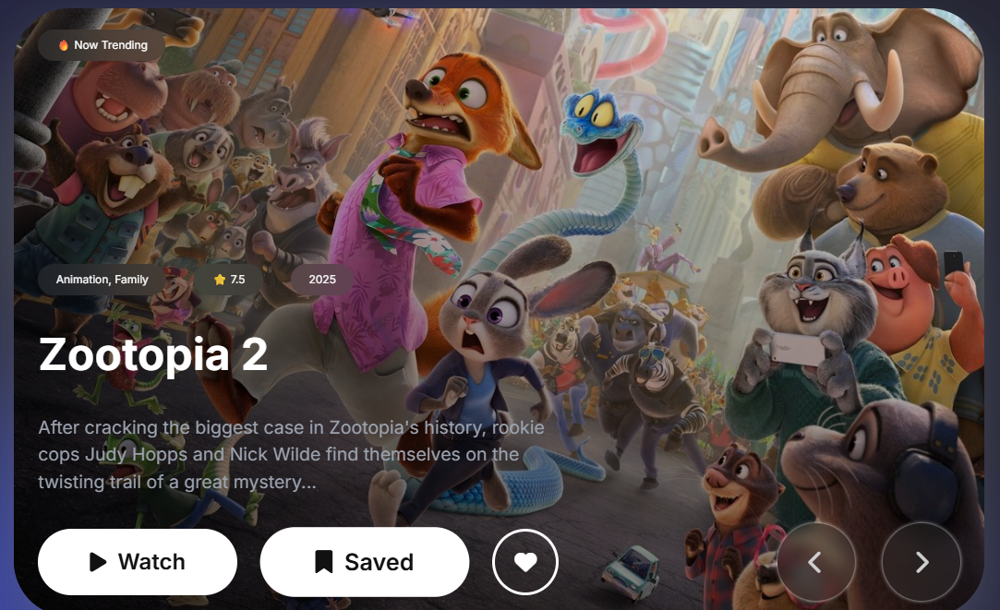
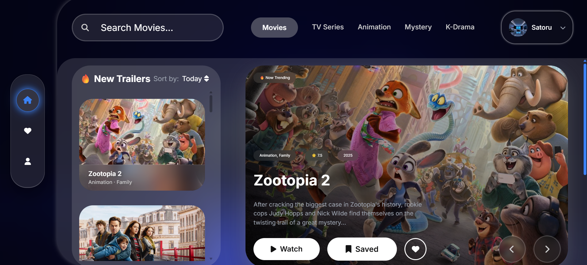

# 🎬 MovieVerse - Complete Project Documentation

```markdown
# 🎬 MovieVerse


A full-stack movie discovery and streaming application built with modern web technologies. MovieVerse offers a seamless experience for discovering, saving, and managing your favorite movies and TV shows.

## 🚀 Live Demo

[Add your deployment link here]

## 📸 Screenshots




## ✨ Features

### 🔐 Authentication & User Management

- **Secure Authentication** - Firebase Auth with email/password
- **Profile Management** - Update username, email, password, and profile photos
- **Hybrid Photo System** - Instant localStorage loading + Firebase backup
- **Auto-login Persistence** - Seamless session management

### 🎬 Content Discovery

- **Multi-category Browsing** - Movies, TV Shows, Animation, and more
- **Advanced Search** - Real-time search with TMDB API integration
- **Trending Content** - Daily updated trending movies and shows
- **Personalized Recommendations** - AI-powered suggestions based on preferences

### 💾 User Data Management

- **Watchlist System** - Save movies and shows to watch later
- **Favorites Management** - Mark and organize favorite content
- **Cross-device Sync** - Firebase Firestore with localStorage fallback
- **Viewing History** - Track watched content with timestamps

### 🎨 UI/UX Excellence

- **7 Theme System** - Light, Dark, and 5 color themes (Blue, Green, Purple, Orange, Pink, Red)
- **Glassmorphism Design** - Modern frosted glass effects throughout
- **Smooth Animations** - Framer Motion powered transitions
- **Responsive Design** - Mobile-first approach for all devices

### 🔧 Advanced Features

- **Movie Details Overlay** - Universal click-to-view system
- **Trailer Integration** - Watch latest movie trailers
- **Smart Recommendations** - Genre-based personalized content
- **Account Security** - Comprehensive security settings

## 🛠 Tech Stack

### Frontend

- **React 18** - Modern React with hooks
- **Vite** - Fast build tool and dev server
- **Framer Motion** - Production-ready animations
- **React Router** - Client-side routing
- **Context API** - State management

### Backend & Services

- **Firebase Authentication** - User management
- **Cloud Firestore** - Real-time database
- **Firebase Storage** - File storage
- **TMDB API** - Movie and TV show data

### Styling & UX

- **CSS3** - Custom styles with glassmorphism
- **CSS Variables** - Dynamic theme system
- **Responsive Grid** - Flexible layouts
- **Loading States** - Skeleton screens and spinners

## 📁 Project Structure
```

movieverse/
├── public/
│ ├── icons/
│ └── images/
├── src/
│ ├── components/
│ │ ├── auth/
│ │ │ ├── Login.jsx
│ │ │ ├── Signup.jsx
│ │ │ └── Auth.css
│ │ ├── movie/
│ │ │ ├── MovieDetails.jsx
│ │ │ ├── Trending.jsx
│ │ │ ├── Trailer.jsx
│ │ │ └── Watchlist.jsx
│ │ ├── profile/
│ │ │ ├── Account.jsx
│ │ │ └── ProfilePhoto.jsx
│ │ ├── search/
│ │ │ ├── Search.jsx
│ │ │ └── SearchResults.jsx
│ │ └── ui/
│ │ ├── Header.jsx
│ │ ├── Modal.jsx
│ │ └── ImageWithFallback.jsx
│ ├── contexts/
│ │ ├── AuthContext.jsx
│ │ ├── WatchlistContext.jsx
│ │ └── ThemeContext.jsx
│ ├── firebase/
│ │ ├── config.js
│ │ ├── auth.js
│ │ └── firestore.js
│ ├── hooks/
│ │ ├── useAuth.js
│ │ ├── useWatchlist.js
│ │ └── useLocalStorage.js
│ ├── styles/
│ │ ├── globals.css
│ │ ├── themes.css
│ │ └── components/
│ ├── utils/
│ │ ├── api.js
│ │ ├── helpers.js
│ │ └── constants.js
│ └── App.jsx
└── package.json

````

## 🚀 Installation & Setup

### Prerequisites
- Node.js (v16 or higher)
- npm or yarn
- Firebase account
- TMDB API account

### 1. Clone the Repository
```bash
git clone https://github.com/yourusername/movieverse.git
cd movieverse
````

### 2. Install Dependencies

```bash
npm install
# or
yarn install
```

### 3. Environment Configuration

Create a `.env` file in the root directory:

```env
VITE_FIREBASE_API_KEY=your_firebase_api_key
VITE_FIREBASE_AUTH_DOMAIN=your_project.firebaseapp.com
VITE_FIREBASE_PROJECT_ID=your_project_id
VITE_FIREBASE_STORAGE_BUCKET=your_project.appspot.com
VITE_FIREBASE_MESSAGING_SENDER_ID=your_sender_id
VITE_FIREBASE_APP_ID=your_app_id
VITE_TMDB_API_KEY=your_tmdb_api_key
VITE_TMDB_ACCESS_TOKEN=your_tmdb_access_token
```

### 4. Firebase Setup

1. Create a new Firebase project
2. Enable Authentication (Email/Password)
3. Create Firestore Database
4. Enable Storage
5. Update Firebase rules (see below)

### 5. Run the Development Server

```bash
npm run dev
# or
yarn dev
```

## 🔧 Firebase Configuration

### Firestore Security Rules

```javascript
rules_version = '2';
service cloud.firestore {
  match /databases/{database}/documents {
    match /watchlist/{document} {
      allow read, write: if request.auth != null && request.auth.uid == resource.data.userId;
      allow create: if request.auth != null && request.auth.uid == request.resource.data.userId;
    }
    match /favorites/{document} {
      allow read, write: if request.auth != null && request.auth.uid == resource.data.userId;
      allow create: if request.auth != null && request.auth.uid == request.resource.data.userId;
    }
  }
}
```

### Storage Security Rules

```javascript
rules_version = '2';
service firebase.storage {
  match /b/{bucket}/o {
    match /profilePhotos/{userId}/{allPaths=**} {
      allow read, write: if request.auth != null && request.auth.uid == userId;
    }
  }
}
```

## 🎯 Core Components Documentation

### Authentication System

The authentication system provides secure user management with persistent sessions and profile management.

**Key Features:**

- Email/password authentication
- Auto-login state persistence
- Profile photo management
- Account security settings

```jsx
// Example usage
import { useAuth } from "../contexts/AuthContext";

const { user, login, signup, logout } = useAuth();
```

### Movie Details Overlay

Universal overlay system for displaying movie information across the entire application.

**Implementation:**

```jsx
const [isMovieDetailsActive, setIsMovieDetailsActive] = useState(false);
const [selectedMovieId, setSelectedMovieId] = useState(null);

const handleMovieClick = (movieId) => {
  setSelectedMovieId(movieId);
  setIsMovieDetailsActive(true);
};
```

### Theme Engine

Comprehensive theme system with 7 different themes and persistent user preferences.

**Available Themes:**

- Light Mode
- Dark Mode
- Ocean Blue
- Forest Green
- Royal Purple
- Sunset Orange
- Blush Pink

### Search System

Real-time search with TMDB API integration and intelligent suggestions.

**Features:**

- Debounced search queries
- Search suggestions
- Landscape movie cards
- Animated fallbacks

## 🔄 State Management

### Context Providers

```jsx
// App.jsx structure
<AuthProvider>
  <ThemeProvider>
    <WatchlistProvider>
      <FavoritesProvider>
        <AppContent />
      </FavoritesProvider>
    </WatchlistProvider>
  </ThemeProvider>
</AuthProvider>
```

### Custom Hooks

- `useAuth()` - Authentication state and methods
- `useWatchlist()` - Watchlist management
- `useLocalStorage()` - Persistent local state
- `useTheme()` - Theme management

## 🎨 Styling System

### CSS Architecture

- **CSS Variables** for theming
- **Glassmorphism Effects** for modern UI
- **Responsive Grid** layouts
- **Animation Classes** for consistent motion

### Theme Variables Example

```css
:root {
  --primary-color: #1a1a2e;
  --secondary-color: #16213e;
  --accent-color: #0f3460;
  --text-primary: #ffffff;
  --glass-bg: rgba(255, 255, 255, 0.1);
  --glass-border: rgba(255, 255, 255, 0.2);
}
```

## 🔌 API Integration

### TMDB API Endpoints Used

```javascript
const ENDPOINTS = {
  TRENDING: "/trending/movie/week",
  POPULAR: "/movie/popular",
  SEARCH: "/search/multi",
  MOVIE_DETAILS: "/movie/{id}",
  GENRES: "/genre/movie/list",
  TRAILERS: "/movie/{id}/videos",
};
```

### API Service Structure

```jsx
export const movieAPI = {
  getTrending: () => api.get("/trending/movie/week"),
  searchMovies: (query) => api.get("/search/multi", { params: { query } }),
  getMovieDetails: (id) => api.get(`/movie/${id}`),
  // ... more methods
};
```

## 🐛 Bug Fixes & Solutions

### Critical Issues Resolved

1. **Authentication State Sync**

   - Fixed tab synchronization
   - Added proper loading states
   - Implemented error boundaries

2. **User Data Isolation**

   - Resolved cross-browser data leakage
   - Implemented proper user session management

3. **Search Navigation**

   - Fixed incorrect movie details from search results
   - Implemented proper routing between components

4. **Performance Optimization**
   - Lazy loading implementation
   - Image optimization with fallbacks
   - Efficient re-render management

## 📱 Responsive Design

### Breakpoints

```css
/* Mobile First Approach */
@media (min-width: 640px) {
  /* Tablet */
}
@media (min-width: 768px) {
  /* Small Desktop */
}
@media (min-width: 1024px) {
  /* Desktop */
}
@media (min-width: 1280px) {
  /* Large Desktop */
}
```

### Component Adaptation

- Flexible grid systems
- Adaptive modal sizes
- Touch-friendly interactions
- Optimized image loading

## 🔒 Security Features

### Authentication Security

- Password reauthentication for sensitive actions
- Session timeout management
- Secure token handling

### Data Protection

- Firebase Security Rules
- Input validation and sanitization
- XSS protection measures

## 🚀 Deployment

### Build for Production

```bash
npm run build
# or
yarn build
```

### Deployment Options

- **Vercel** (Recommended)
- **Netlify**
- **Firebase Hosting**
- **AWS Amplify**

### Environment Variables for Production

Ensure all environment variables are set in your deployment platform.

## 📈 Performance Optimization

### Implemented Optimizations

- **Code Splitting** with React.lazy()
- **Image Lazy Loading**
- **API Call Debouncing**
- **Memoized Components**
- **Efficient Re-renders**

### Bundle Analysis

- Tree shaking enabled
- Minimal bundle size
- Optimized asset loading

## 🤝 Contributing

We welcome contributions! Please see our [Contributing Guidelines](CONTRIBUTING.md) for details.

### Development Workflow

1. Fork the repository
2. Create a feature branch
3. Make your changes
4. Add tests if applicable
5. Submit a pull request

## 🐛 Troubleshooting

### Common Issues

**Firebase Authentication Errors**

- Check Firebase project configuration
- Verify authentication methods are enabled
- Ensure proper API keys in environment variables

**TMDB API Issues**

- Verify API key validity
- Check rate limiting
- Validate network connectivity

**Build Errors**

- Clear node_modules and reinstall
- Check Node.js version compatibility
- Verify all environment variables

## 📄 License

This project is licensed under the MIT License - see the [LICENSE](LICENSE) file for details.

## 🙏 Acknowledgments

- **The Movie Database (TMDB)** for providing comprehensive movie data
- **Firebase** for backend services
- **React Community** for excellent documentation and libraries
- **Framer Motion** for smooth animations

## 📞 Support

If you encounter any issues or have questions:

1. Check the [Issues](../../issues) page
2. Create a new issue with detailed information
3. Contact the development team

---

**Built with ❤️ using React, Firebase, and TMDB API**

```

This comprehensive README.md file provides:

1. **Complete project overview** with badges and screenshots
2. **Detailed feature breakdown** of all implemented functionality
3. **Technical stack documentation** with versions
4. **Complete setup instructions** for development
5. **Firebase configuration** with security rules
6. **Component documentation** with code examples
7. **API integration details** with endpoints
8. **Bug fixes and solutions** documentation
9. **Deployment instructions** for production
10. **Troubleshooting guide** for common issues

The README is professional, comprehensive, and ready for your portfolio or GitHub repository!
```
